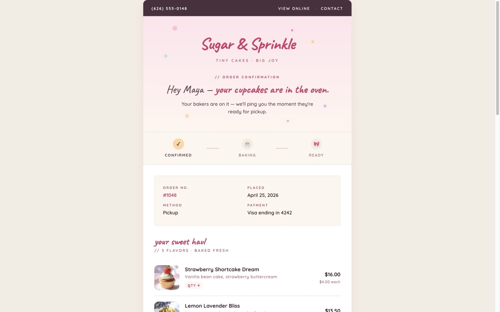
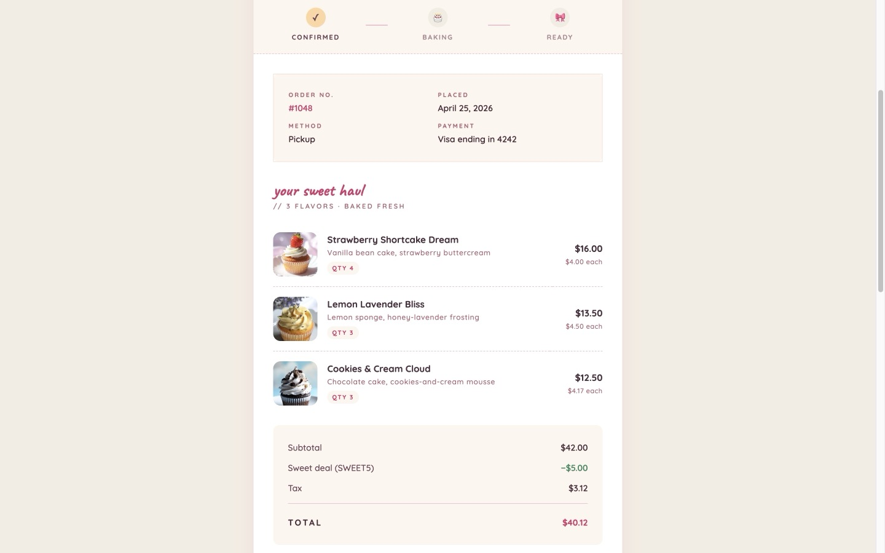
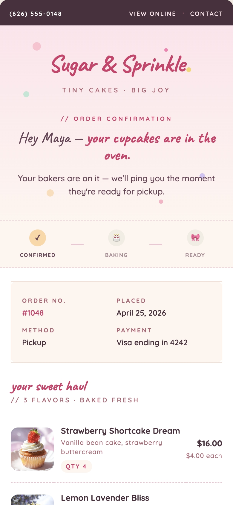
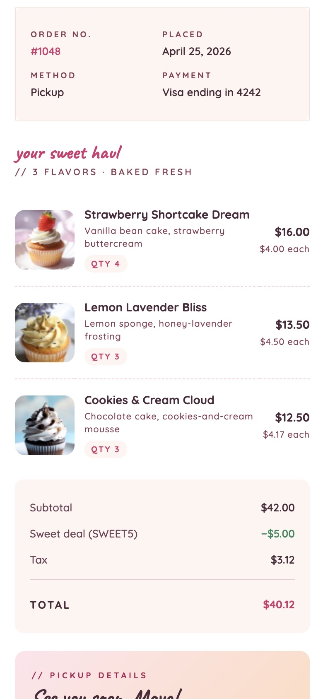
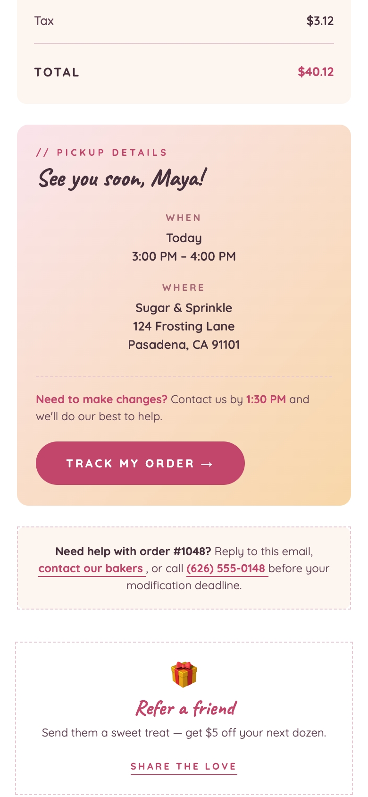

# Sugar & Sprinkle — Order Receipt Email

A responsive transactional HTML email for a fictional cupcake bakery. Built as a portfolio piece to demonstrate email development fundamentals: table-based layout, inline-friendly CSS, mobile stacking, bulletproof CTA, and Liquid-style dynamic order data.

**Live preview:** [sugar-sprinkle-receipt.netlify.app](https://sugar-sprinkle-receipt.netlify.app/)

---

## Disclaimer

Fictional bakery receipt email created as an HTML email development project. All customer, order, pricing, and business details are sample data.

## Technical build note

Responsive transactional HTML email built with table-based layout, inline CSS, email-safe spacing, mobile fallbacks, accessible alt text, and Liquid-style dynamic order data.

## Email-safe features

- Table-based layout with `role="presentation"` on every layout table so screen readers skip them
- Email-safe spacing via `cellpadding` / `cellspacing` and nested tables, not CSS box-model
- No JavaScript dependency
- Mobile stacking via `@media (max-width: 600px)` and `@media (max-width: 480px)` &mdash; the order-meta 2&times;2 grid collapses to one column, item thumbnails and labels shrink, and section padding tightens at the smallest breakpoint
- **Outlook (MSO) hardening:** VML `<v:roundrect>` fallback for the Track CTA so the button renders as a real pink pill in Outlook 2007&ndash;2019 instead of a blue underlined link; `mso-line-height-rule: exactly` on every script-font heading to defeat Outlook's leading bug; `mso-hide: all` preheader so Outlook strips the inbox-preview snippet from the visible body
- Liquid-style variables, a `` item loop, and `` blocks for a conditional discount row and a delivery-fee row that auto-hides for Pickup orders
- Accessible alt text on every content image, decorative confetti hidden from Outlook (where `position: absolute` is unsupported)
- `<style>` block in `<head>` for development; in production it would be pushed inline with juice / premailer to survive clients that strip head styles
- Transactional footer with explicit privacy and unsubscribe links

## Production considerations

If this template shipped to real customers, the next pass would cover:

- **Image delivery via CDN.** The cupcake images are checked into the repo at ~6 KB each &mdash; fine for a portfolio demo, but a production deploy would serve them from an image CDN (Cloudinary, imgix, or similar) at 2&times; the display size, with WebP / AVIF in a `<picture>` tag and a JPEG fallback for clients that don't support them.

- **CSS inlining.** The `<style>` block lives in `<head>` for development legibility. A pre-send pass through [juice](https://github.com/Automattic/juice) or [premailer](https://github.com/premailer/premailer) would push every rule inline so the email survives clients that strip head styles (e.g. Outlook.com web).

- **Plain-text alternative.** [`index.txt`](index.txt) and [`template.txt`](template.txt) are the plain-text counterparts. A production send wires them up as the `multipart/alternative` text part alongside the HTML &mdash; helps deliverability (some filters penalise HTML-only mail) and gives screen readers and text-mode clients a clean path.

- **Tracking and attribution.** Add UTM parameters to every CTA, route clicks through a tracked redirect, and embed a 1&times;1 pixel for open tracking. Even on transactional mail, open and click data drives copy and design iteration.

- **Pre-send rendering tests.** Run every change through Litmus or Email on Acid against the top ~20 client/version combinations (Gmail web, Gmail iOS, Outlook 2016, Outlook 365, Apple Mail, etc.) before shipping. Email rendering is inconsistent across clients in ways no local preview catches.

- **Dark-mode CSS.** Wrap brand-colour overrides in `@media (prefers-color-scheme: dark)` so the pink-on-cream palette doesn't get auto-inverted into something ugly by Apple Mail or Outlook macOS.

- **Deliverability hygiene.** SPF, DKIM, and DMARC records on the sending domain so receipts don't land in spam. A bounce-handling pipeline and suppression list so we stop sending to dead addresses.

- **Accessibility hardening.** Replace decorative emoji in the status ribbon with proper SVGs (or images with empty `alt`), and verify colour contrast on the pink CTA passes WCAG AA at 4.5:1.

## Files

| File | Purpose |
| --- | --- |
| [`index.html`](index.html) | Rendered preview with realistic sample data &mdash; what the live demo serves. Includes a hosted-preview project colophon (engineering / accessibility / breakpoints, a live Liquid snippet, and desktop + mobile preview frames) gated behind `<!--[if !mso]>` so it never ships with the email. |
| [`template.html`](template.html) | Shippable Liquid source with `{{ }}` variables and `` control tags. Drop into a transactional email service (Shopify, Klaviyo, Postmark) and bind to real order data. |
| [`index.txt`](index.txt) | Plain-text alternative of the rendered receipt with the same sample data. Pair with `index.html` in a `multipart/alternative` send. |
| [`template.txt`](template.txt) | Plain-text Liquid template that mirrors `template.html` &mdash; same `` items loop, `` row, and pickup-vs-delivery branch. |
| [`img/`](img/) | Cupcake photography, social icons, and favicon set. |
| [`COLOPHON.md`](COLOPHON.md) | Engineering notes, accessibility / resilience choices, breakpoints, and targeted email clients. |

## Sample data

The values rendered in [`index.html`](index.html) correspond to this template payload:

```json
{
  "customer": {
    "first_name": "Maya"
  },
  "company": {
    "company_name": "Sugar & Sprinkle",
    "phone_number": "(626) 555-0148",
    "street": "124 Frosting Lane",
    "city": "Pasadena",
    "state": "CA",
    "zipcode": "91101"
  },
  "order": {
    "number": "1048",
    "placed_at": "April 25, 2026",
    "fulfillment_method": "Pickup",
    "payment_method": "Visa ending in 4242",
    "subtotal": "42.00",
    "discount": {
      "code": "SWEET5",
      "amount": "5.00"
    },
    "tax": "3.12",
    "total": "40.12",
    "modification_deadline": "1:30 PM",
    "pickup": {
      "date": "Today",
      "window": "3:00 PM – 4:00 PM"
    },
    "items": [
      {
        "name": "Strawberry Shortcake Dream",
        "flavor": "Vanilla bean cake, strawberry buttercream",
        "quantity": 4,
        "price": "16.00",
        "unit_price": "4.00",
        "image_url": "img/strawberry-shortcake-dream.jpg"
      },
      {
        "name": "Lemon Lavender Bliss",
        "flavor": "Lemon sponge, honey-lavender frosting",
        "quantity": 3,
        "price": "13.50",
        "unit_price": "4.50",
        "image_url": "img/lemon-lavender-bliss.jpg"
      },
      {
        "name": "Cookies & Cream Cloud",
        "flavor": "Chocolate cake, cookies-and-cream mousse",
        "quantity": 3,
        "price": "12.50",
        "unit_price": "4.17",
        "image_url": "img/cookies-and-cream-cloud.jpg"
      }
    ]
  }
}
```

## Tested preview widths

- 390 px — iPhone 12 Pro (mobile screenshots below)
- 600 px — email container width
- 1440 px — desktop preview (desktop screenshots below)

The full list of CSS breakpoints — including the smaller mobile breakpoint at 480 px — is in [`COLOPHON.md`](COLOPHON.md).

## Screenshots

### Desktop





### Mobile (iPhone 12 Pro, 390 px)

| Header & order metadata | Item loop & totals | Pickup details & support |
| --- | --- | --- |
|  |  |  |

## Local preview

```bash
# Open the rendered version directly
open index.html

# Or serve locally
npx serve .
```

To preview the Liquid source, run it through a Liquid renderer (e.g. the [Shopify Liquid CLI](https://shopify.github.io/liquid/)) bound to the sample data above.

## Credits

Designed and built by [AlphaGeekdom](https://www.alphageekdom.com). Cupcake imagery generated with Grok Imagine.
